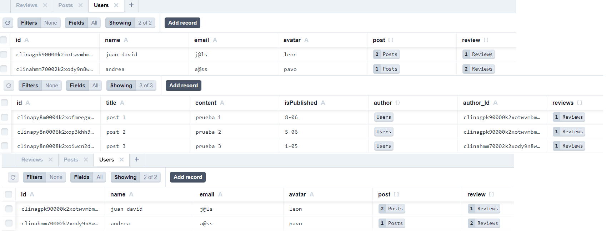

# Make It Real - API-Typescript-Prisma

## This is a solution to the _creation of API with typescript and prisma_ project of the Make It Real course.

## The challenge

Create an API with typescript and prisma wich take CRUD operations

## Screenshot

### Built with

- Semantic markup using vscode editor
- Prism ORM
- Typescript
- Node.js
- Express
- Postman
- Postgres
- pgAdmin

## What We learned

I practice how to create an API using backend technologies

## Authors

Juan David Peña
github - @juandape - @miguelchaparrocolo - @guialexander
email - juandavidp76@gmail.com

## Acknowledgments

Thanks to Make it Real to show us a path to become a better programmers
